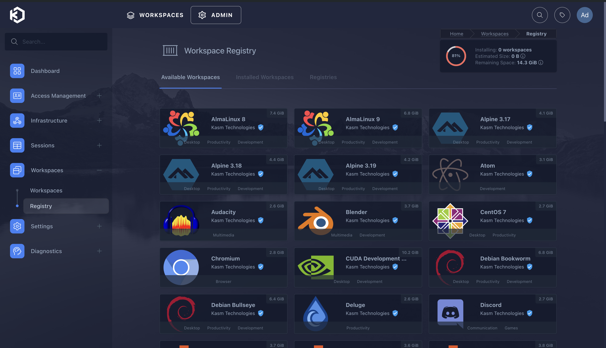

# AdGuard DNS Server

## Objective

The goal of this project is to set up a DNS server running using Ad Guard. This will not only build help to develop your understanding of networking and DNS, but it will also set up adblocking on your entire network!

### Skills Learned

- Improved understanding of networking configuration and DNS function. 
- Configuring a DNS server on an existing network. 
- Setting up a Remote Linux Server
- Confiuring a Linux server to have a static IP address.
- Watching Hulu Ad-Free!!!

### Tools Used

- Rasberry PI 5 to host the DNS Server Locally
- -Rasberry OS (Lite)
- AD-Guard, the DNS Server service that you will be running in the Linux OS.
- Unifi OS (In this project Unifi networking solutions were used, but any modern router should work just fine).

## Steps

1. Set up a Linux VM (specifically an Ubuntu OS, either Desktop or server would work).

2. Create a swap partition for additional stability. Use the following commands:

 - sudo fallocate -l 4g /mnt/4GiB.swap
 - sudo chmod 600 /mnt/4GiB.swap
 - sudo mkswap /mnt/4GiB.swap
 - sudo swapon /mnt/4GiB.swap

 Verify the Swap Exist:
 - cat /proc/swaps
 
 Make the Swap Available on Boot:
 -echo '/mnt/4GiB.swap swap swap defaults 0 0' | sudo tee -a /etc/fstab

3. If you do not have docker installed already on your linux machine, you can install it with the following commands:

 - sudo apt install apt-transport-https ca-certificates curl software-properties-common -y
 - curl -fsSL https://download.docker.com/linux/ubuntu/gpg | sudo apt-key add -
 - sudo add-apt-repository "deb [arch=amd64] https://download.docker.com/linux/ubuntu $(lsb_release -cs) stable"
 - sudo apt update
 - sudo apt install docker-ce -y 

4. Install Kasm:
 - cd /tmp
 - curl -O https://kasm-static-content.s3.amazonaws.com/kasm_release_1.15.0.06fdc8.tar.gz
 - tar -xf kasm_release_1.15.0.06fdc8.tar.gz
 - sudo bash kasm_release/install.sh

5. Log into the Web Application running on port 443 at https://<WEBAPP_SERVER>
 - The Default usernames are admin@kasm.local and user@kasm.local. The passwords will be randomly generated and presented at the end of the install unless the --admin-password or/and --user-password are specified. 

 

6. Once signed in, you can go go to registry on left hand side, and start installing some workspaces! 

 
