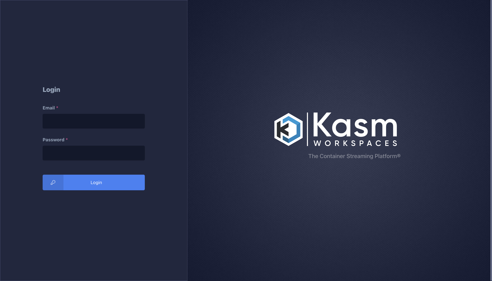

# Kasm Worskspaces

## Objective

The goal of this project is to set up a Kasm Workspace solution for your homelab. This will give you isolated enviroments that you can stream to your browser.

### Skills Learned

- Remote Linux Server Set up and Config

### Tools Used

- Ubuntu Desktop or Ubuntu Server
- Kasm Worskpaces

## Steps

1. Set up a Linux VM (specifically an Ubuntu OS, either Desktop or server would work). 
 - Pro tip! It is best to SSH into a linux machine (if it is remote at least) so you can copy and paste the commands into it. 

2. SSH into your Linux server (recommended for remote management):

 First, ensure SSH is enabled on your Ubuntu server:
 ```bash
 sudo systemctl enable ssh
 sudo systemctl start ssh
 ```

 From your local machine, connect to the server:
 ```bash
 ssh username@server_ip_address
 ```
 
 Replace `username` with your Ubuntu username and `server_ip_address` with your server's IP address.
 
 If this is your first time connecting, you'll be prompted to accept the server's fingerprint. Type `yes` to continue.

3. Create a swap partition for additional stability. Use the following commands:

 ```htm
 sudo fallocate -l 4g /mnt/4GiB.swap
 sudo chmod 600 /mnt/4GiB.swap
 sudo mkswap /mnt/4GiB.swap
 sudo swapon /mnt/4GiB.swap
 ```

 Verify the Swap Exist:
```htm
  cat /proc/swaps

``` 
 Make the Swap Available on Boot:
  ```htm
  echo '/mnt/4GiB.swap swap swap defaults 0 0' | sudo tee -a /etc/fstab
  ```

4. If you do not have docker installed already on your linux machine, you can install it with the following commands:

```htm
 sudo apt install apt-transport-https ca-certificates curl software-properties-common -y
 curl -fsSL https://download.docker.com/linux/ubuntu/gpg | sudo apt-key add -
 sudo add-apt-repository "deb [arch=amd64] https://download.docker.com/linux/ubuntu $(lsb_release -cs) stable"
 sudo apt update
 sudo apt install docker-ce -y 
```

5. Install Kasm:
```htm
 cd /tmp
 curl -O https://kasm-static-content.s3.amazonaws.com/kasm_release_1.15.0.06fdc8.tar.gz
 tar -xf kasm_release_1.15.0.06fdc8.tar.gz
 sudo bash kasm_release/install.sh
```

6. Log into the Web Application running on port 443 at https://<WEBAPP_SERVER>
 - The Default usernames are admin@kasm.local and user@kasm.local. The passwords will be randomly generated and presented at the end of the install unless the --admin-password or/and --user-password are specified. 

 

7. Once signed in, you can go go to registry on left hand side, and start installing some workspaces! 

 

8. Once you have a workspace up and running, you can add the [Kasm extension](https://chromewebstore.google.com/detail/kasm-open-in-isolation/pamimfbchojeflegdjgijcgnoghgfemn "Kasm extension") to your browser (chromium), which will allow you to rightclick a link, and open in an isolated enviroment via Kasm Workspace:


